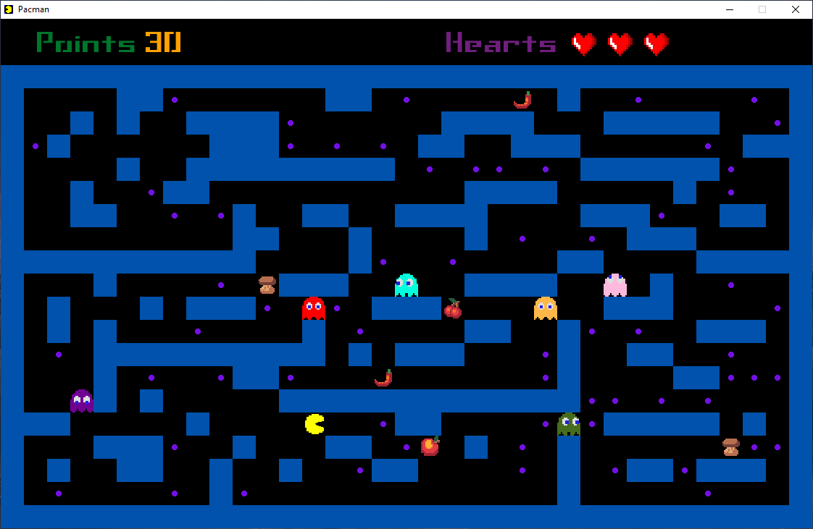
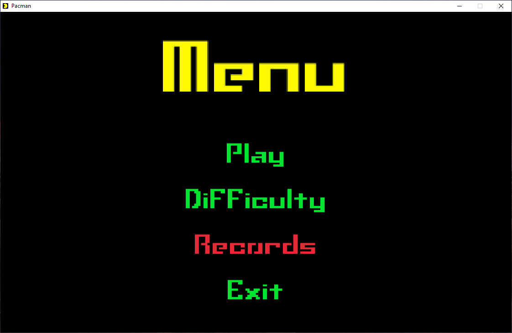
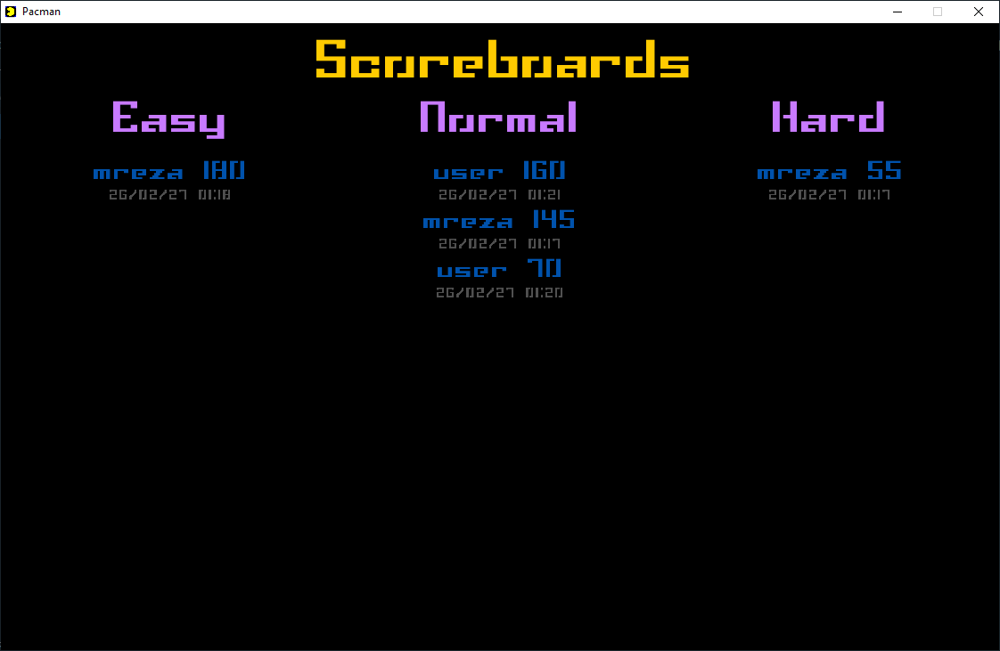

# 🎮 Pacman Game – C Programming Project




A classic Pacman clone written in **C** using the **Raylib** library. This project was developed as the final project for the **"Fundamentals of Programming (BP)"** course. It demonstrates core programming concepts: **2D arrays, file I/O, pointers, structs, basic AI, and graphics programming** – all wrapped into a fully playable game.

---

## 📚 Project Goals & Learning Outcomes
- Practice **structured programming** in pure C.
- Use **file handling** to store and retrieve high scores persistently.
- Work with **external libraries** (Raylib) for graphics, audio, and input.
- Design **simple AI** for multiple ghost characters.
- Embed **assets (images, sounds, fonts)** directly into the executable.
- Create a **cross-platform build system** with CMake.

---

## ✨ Game Features

### 🎮 Core Gameplay
- Navigate Pacman through mazes, eat all dots to win.
- Avoid ghosts – they chase you with unique behaviors.
- Special items appear randomly and grant bonuses.

### 🍎 Items & Power‑Ups
| Item      | Icon | Effect |
|-----------|------|--------|
| **Apple**  | 🍎   | Grants an **extra life** (heart). |
| **Cherry** | 🍒   | Pacman can **eat ghosts** for a short time; each ghost eaten gives bonus points. |
| **Pepper** | 🌶️   | Temporarily **increases Pacman’s speed**. |
| **Mushroom** | 🍄 | **Reduces health** – lose one life. |

### 👻 Ghosts
- **7 ghost types** (Blinky, Pinky, Inky, Clyde, Berrypie, Rocky, Snowwhite).
- 3 different **movement pattern**.
- When you eat a Cherry, ghosts turn **blue** and can be eaten for extra points.

### 🧩 Difficulty Levels
Three difficulty modes (**Easy, Normal, Hard**) affect:
- **Ghost speed** – faster on higher difficulties.
- **Number of ghosts** – more ghosts appear.
- **Item spawn rates** – frequency of special items.
- **Map layout** – each difficulty uses a different predefined map.

### 📊 High Scores
- Top **10 scores** are saved **per difficulty level**.
- Scores persist across game sessions – stored in the user’s system folder:
  - **Windows**: `%APPDATA%\Pacman\rank.txt`
  - **Linux/macOS**: `~/.local/share/pacman/rank.txt`
- You can **clear the scores** from the scoreboard screen (press `Delete`).

### 💾 Single‑File Executable
All assets (images, sounds, fonts) are **embedded into the executable** using a Python script. The final `.exe` is completely standalone – no external files needed.


## 🚀 How to Run

### Option 1 – Download Pre‑built Executable
Check the **[Releases](https://github.com/Mreza5760/pacman-game/releases)** page for the latest version.  
Download the `.exe` (Windows) or the appropriate binary for your OS – **no installation required**.

### Option 2 – Build from Source
#### Prerequisites
- [CMake](https://cmake.org/) (version 3.15 or higher)
- [Raylib](https://www.raylib.com/) (compiled as a **static** library)
- Python 3 (for the asset embedding script)

#### Build Steps
```bash
# 1. Clone the repository
git clone https://github.com/Mreza5760/pacman-game.git
cd pacman-game

# 2. Generate embedded asset files
python scripts/embed_assets.py

# 3. Build with CMake
mkdir build && cd build
cmake .. -DBUILD_SHARED_LIBS=OFF -DCMAKE_BUILD_TYPE=Release
cmake --build . --config Release
```

## 🕹️ How to Play

| Key         | Action                               |
|-------------|--------------------------------------|
| **Arrow keys** | Move Pacman up, down, left, right |
| **M**        | Return to the main menu              |
| **Delete**   | Clear all high scores (on scoreboard screen) |
| **ESC**      | Exit the game while playing          |

---

## 📸 Screenshots

> *(Add your own screenshots inside a `screenshots/` folder. Recommended files: `menu.png`, `gameplay.png`, `scoreboard.png`)*

| Main Menu | Gameplay | Scoreboard |
|-----------|----------|------------|
|  |  |  |


## 📄 License
This project is licensed under the MIT License. See the [LICENSE](LICENSE) file for details.

---

Enjoy the game, and feel free to contribute or report issues! 🎮
